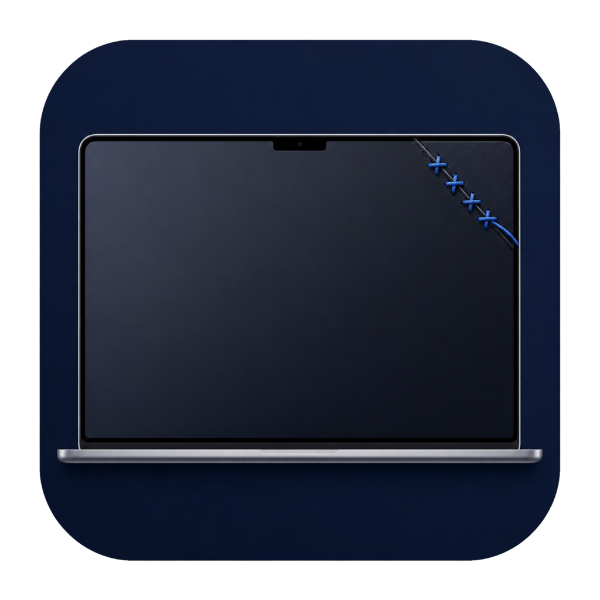
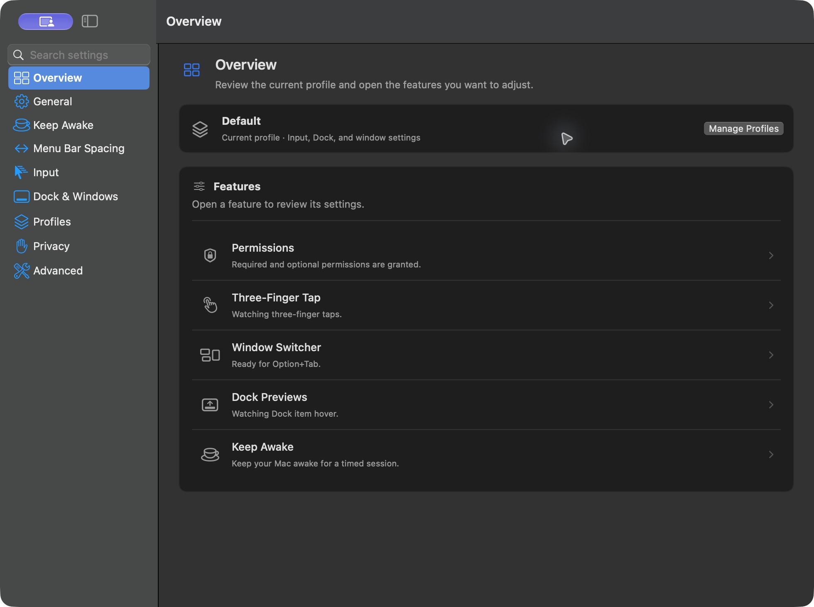
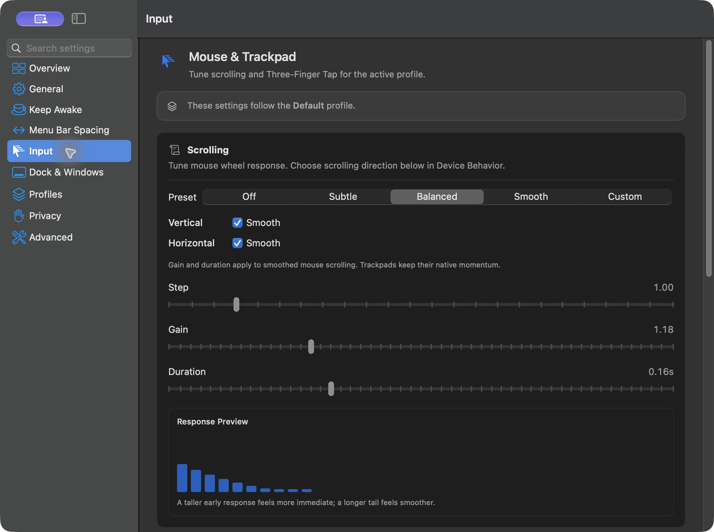
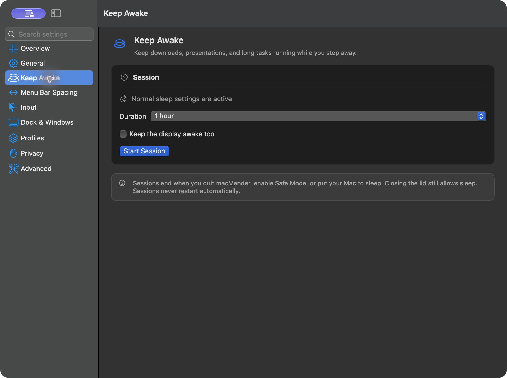

<p align="center">
  
</p>
<h1 align="center">macMender</h1>
<p align="center"><strong>Small improvements. A Mac that feels like yours.</strong></p>
<p align="center">Window previews · Better scrolling · Trackpad middle click · Keep Awake</p>
<p align="center">
  <a href="https://github.com/0hmslice/macMender/releases/latest">Download</a> ·
  <a href="#get-started">Get started</a> ·
  <a href="#build-it">Build it</a> ·
  <a href="https://github.com/0hmslice/macMender/issues">Report an issue</a>
</p>



Free, open source, and local. No accounts, analytics, or subscriptions.

> **Development preview:** this README and its screenshots show the upcoming upgrade. The latest downloadable release is **v0.9.0**; build this branch to try the additions below.

## Make everyday things easier

| | What you get |
| :-- | :-- |
| **Dock previews** | Hover over a Dock app, see its windows, and choose one. |
| **Window switching** | Option–Tab through windows, with thumbnails and Shift to cycle backwards. |
| **Scrolling** | Tune mouse smoothing and direction. Give individual apps their own rules—or leave their scrolling native. |
| **Middle click** | Use a three-finger trackpad tap, modifier-click, or an extra mouse button. |
| **Keep Awake** | Start a 15-minute to 2-hour session, or keep going until stopped. Optionally keep the display awake. |
| **Profiles & quick controls** | Save different setups, search settings, and pause helpers from the menu bar. |

<table>
  <tr>
    <td width="50%"><br><strong>Scrolling, your way</strong></td>
    <td width="50%"><br><strong>A little more time awake</strong></td>
  </tr>
</table>

## Get started

**Release requirements:** Apple silicon · macOS 26 or newer.

1. Download the ZIP from [Releases](https://github.com/0hmslice/macMender/releases/latest), unzip it, and move **macMender.app** to **Applications**.
2. Open macMender and follow onboarding. If macOS blocks the download, review **System Settings → Privacy & Security → Open Anyway**.
3. Enable the features you want. Open **Privacy** in macMender to review permissions.

| Permission | Why it is used |
| :-- | :-- |
| **Accessibility** | Global shortcuts, input adjustments, Dock detection, and window actions. |
| **Screen Recording — optional** | Local window thumbnails. Basic window switching works without thumbnails. |

Settings stay in `~/Library/Application Support/macMender/`. Use **Advanced → Configuration** to export or import them. Three-finger tap uses a private macOS framework and may change with OS updates.

## At your fingertips

| Action | Default control |
| :-- | :-- |
| Next / previous window | **⌥ Tab** / **⌥ ⇧ Tab**; release Option to select, Escape to cancel |
| Quick controls | Click the menu bar icon; **⌘ ⇧ M** while macMender is active |
| Middle click | Three-finger trackpad tap |
| Pause helpers | **Pause Helpers** in quick controls, or Safe Mode in Advanced |

Keep Awake ends when stopped, when its timer expires, on sleep, when helpers are paused, or when macMender quits. It does not override closed-lid sleep.

## Menu bar spacing

**Limited on macOS 27.** macMender adjusts its own icon and saves spacing preferences for compatible apps. Our test on macOS 27.0 (26A428) found **no movement of Apple’s Wi-Fi, sound, battery, Control Center, or clock items**, even with the newly reported MenuBarAgent restart method. Other apps may need relaunch; full system-wide control is not promised.

Use **Menu Bar Spacing → Apply** to try it; **Reset to Default** removes the overrides. Read the [dated findings and limitations](docs/UPGRADE.md#menu-bar-spacing-current-evidence) before relying on it.

## Build it

Install Xcode 26 or newer (macOS 26 SDK, Swift 6.2+), then:

```sh
git clone https://github.com/0hmslice/macMender.git
cd macMender
swift test
./script/build_and_run.sh
```

The script creates and opens `dist/macMender.app`. For an optimized bundle without launching:

```sh
BUILD_CONFIGURATION=release ./script/build_and_run.sh --build-only
```

The package declares macOS 14 as its compilation minimum; that is not a claim of full feature testing on older systems. See the [upgrade notes](docs/UPGRADE.md) for architecture, comparison research, and validation scope.

<details>
<summary><strong>Something not working?</strong></summary>

- **Input or shortcuts:** check Accessibility permission, then quit and reopen macMender. Pause similar utilities while troubleshooting conflicting rules.
- **Missing thumbnails:** grant Screen Recording, or use the switcher without thumbnails.
- **Unexpected scrolling in one app:** add it under Input → App Overrides and enable native scrolling.
- **Need to undo a setup:** pause helpers immediately; restore an exported configuration from Advanced. Menu bar spacing has its own Reset to Default.
- **Reporting a bug:** include your macOS version, macMender version, and steps to reproduce. Review diagnostic exports before sharing them.

</details>

---

[MIT license](LICENSE) · [Third-party notices](THIRD_PARTY_NOTICES.md) · [Upgrade notes](docs/UPGRADE.md)
