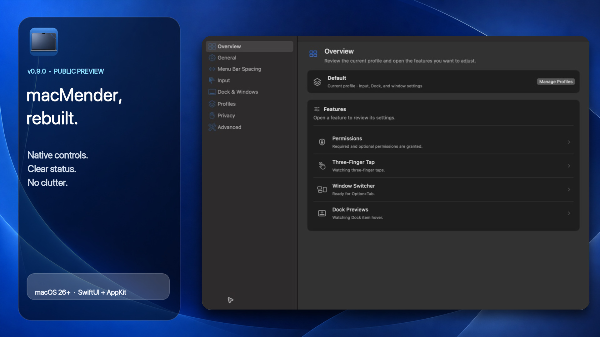
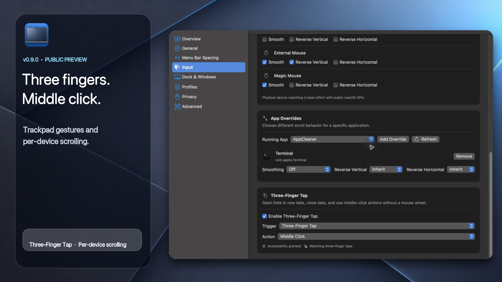
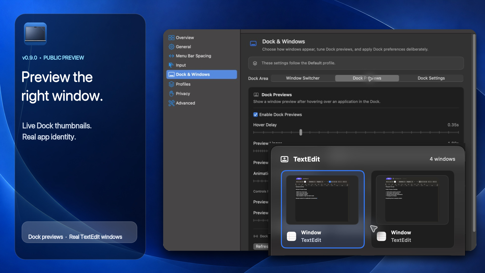
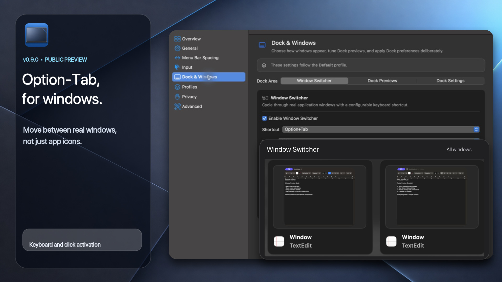
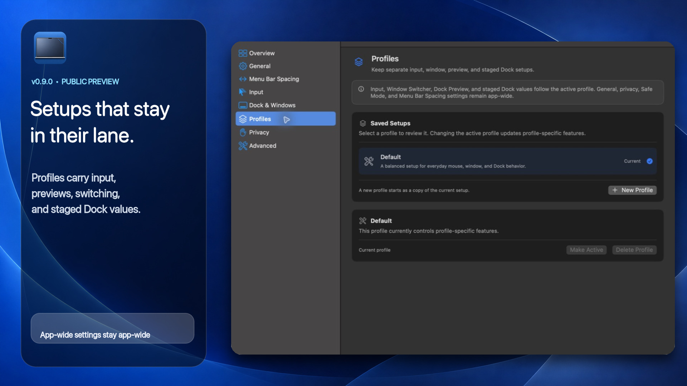
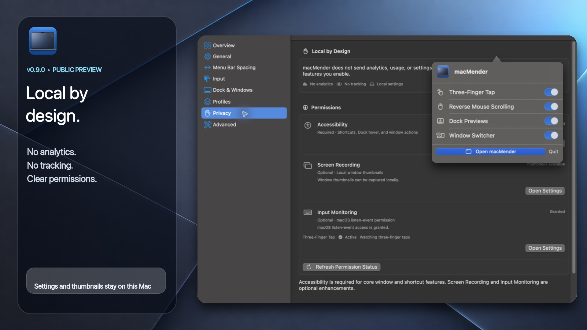
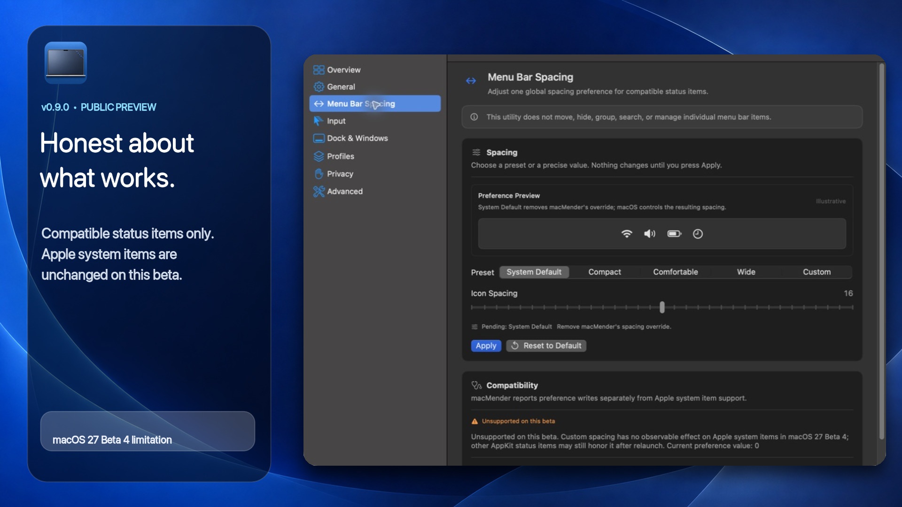
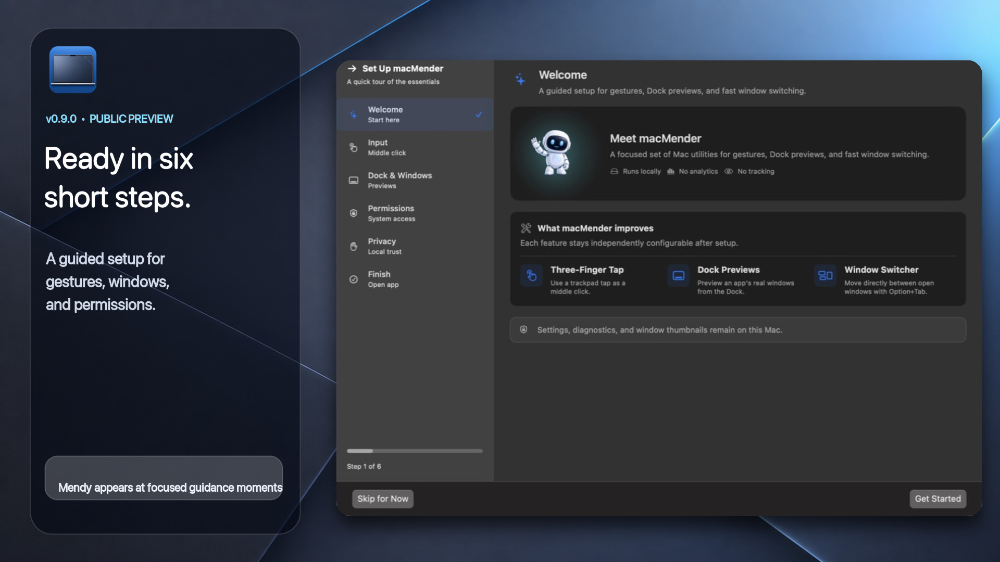

<p align="center">
  
</p>

# macMender

macMender is a free, open-source macOS utility for better Dock previews, window switching, trackpad gestures, and scrolling controls.

**v0.9.0 is a public preview.** It is staying pre-1.0 while Menu Bar Spacing remains limited on the current macOS beta.

[Download macMender](https://github.com/0hmslice/macMender/releases/tag/v0.9.0) · [Report an issue](https://github.com/0hmslice/macMender/issues)

## Download

Download [`macMender-v0.9.0.zip`](https://github.com/0hmslice/macMender/releases/download/v0.9.0/macMender-v0.9.0.zip) from the [v0.9.0 release](https://github.com/0hmslice/macMender/releases/tag/v0.9.0), unzip it, and move `macMender.app` to Applications.

## Features

| Feature | What it does |
| --- | --- |
| Dock Previews | Shows the windows belonging to the app under your pointer and opens the one you choose. |
| Window Switcher | Uses Option-Tab to move between actual windows, not just application icons. |
| Three-Finger Tap | Turns a three-finger trackpad tap into a middle click. |
| Scrolling Controls | Adjusts direction, speed, smoothing, and per-app behavior for different pointing devices. |
| Profiles | Keeps separate input, preview, switching, and Dock setups. |
| Quick Controls | Puts the most-used settings in a small menu bar popover. |
| Menu Bar Spacing (preview) | Makes compatible third-party menu bar icons sit closer together or farther apart. Apple's built-in icons are not affected yet. |

<table>
  <tr>
    <td width="50%"></td>
    <td width="50%"></td>
  </tr>
  <tr>
    <td></td>
    <td></td>
  </tr>
  <tr>
    <td></td>
    <td></td>
  </tr>
  <tr>
    <td colspan="2"></td>
  </tr>
</table>

## Private by default

- No analytics or tracking
- No remote configuration
- Settings stay on your Mac
- Screen Recording is optional and used only for local window thumbnails

## Requirements

- macOS 26 or newer
- Apple silicon
- Accessibility permission for Dock, window, shortcut, and gesture features
- Screen Recording only if you want live window thumbnails

## Build from source

```bash
swift build
swift test
./script/build_and_run.sh
```

Three-Finger Tap uses a private macOS API, which is why macMender is distributed directly from GitHub instead of through the Mac App Store.

macMender is MIT licensed. See [THIRD_PARTY_NOTICES.md](THIRD_PARTY_NOTICES.md) for attribution.
